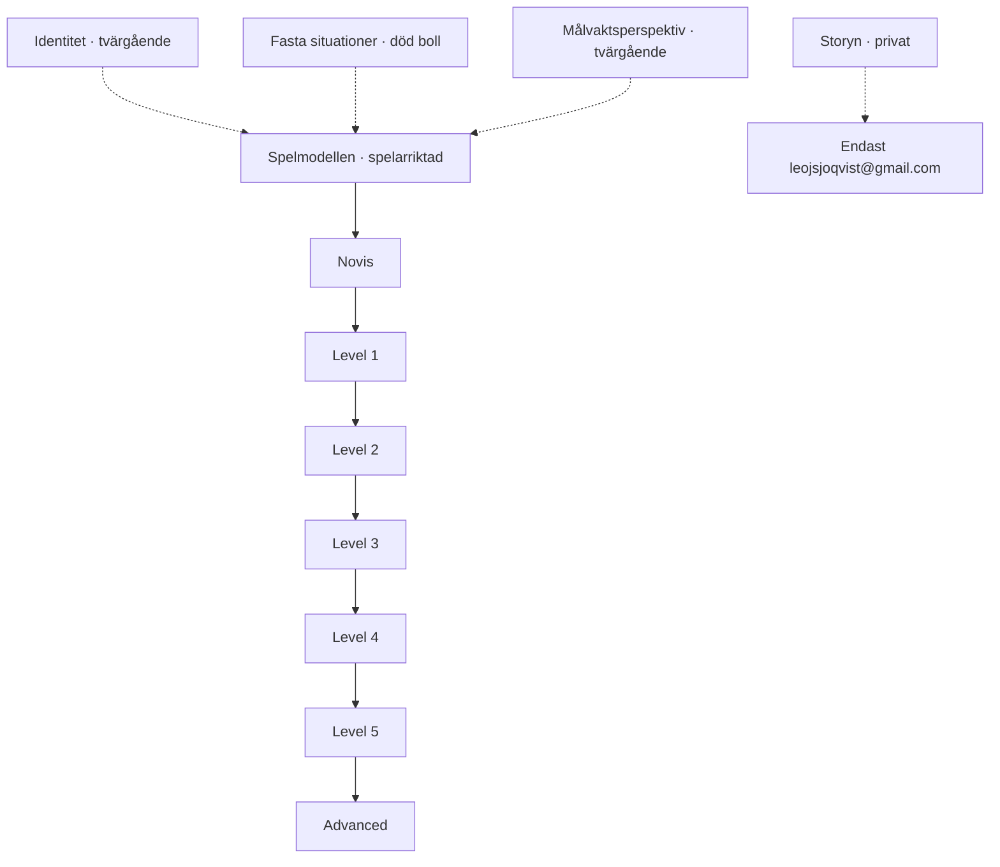
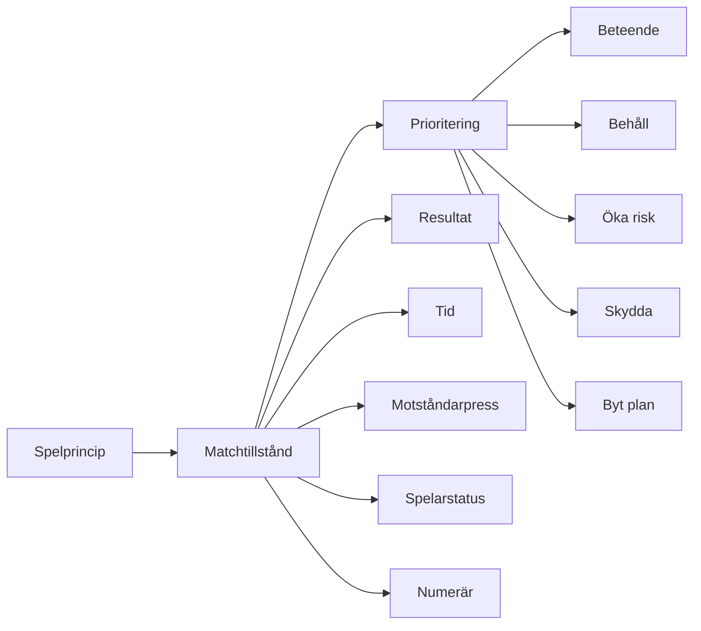
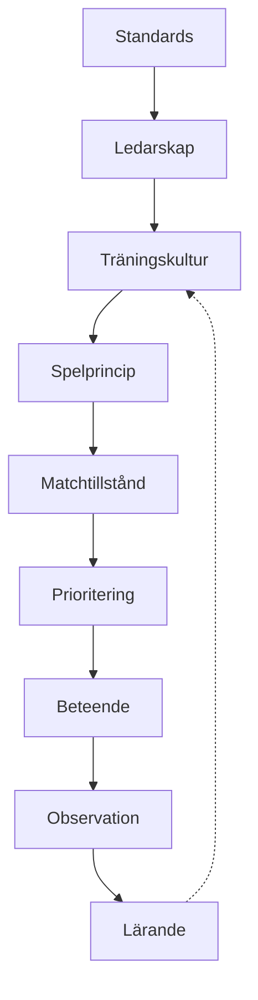

# Spelmodellen, nivåtrappan och Storyn – designspecifikation

**Datum:** 2026-07-17  
**Status:** Godkänd design  
**Projekt:** Spelmodellen.se / `Coachen00/gunnilseis2026`

## Mål

Göra spelmodellen tydlig och spelarriktad genom en sammanhängande nivåtrappa från `Novis` till `Advanced`, samtidigt som `Storyn` och allt privat idé- och utvecklingsmaterial separeras till ett ägarområde som endast är åtkomligt för Supabase-kontot `leojsjoqvist@gmail.com`.

## Beslutade gränser

### Publikt spelarmaterial

`Spelmodell` är till för spelarna. Den ska inte innehålla Joels privata resonemang, arbetsanteckningar eller material under utveckling. Spelare med vanlig godkänd Supabase-inloggning eller delad laginloggning ska kunna använda spelmodellen enligt sajtens befintliga åtkomstmodell.

### Privat ägarmaterial

`Storyn` är en egen toppkategori i det privata området. Den får endast visas efter en riktig Supabase-session där e-postadressen, normaliserad till gemener och trimmad, är exakt `leojsjoqvist@gmail.com`. Delad spelar-/tränarinloggning, andra admins och adressvarianter ger inte åtkomst.

Privat innehåll ska inte importeras i den publika spelmodellens statiska datafiler. Ägarens route ska laddas separat efter ägarverifiering. Om materialet lagras i Supabase ska tabeller/storage använda ägarens e-post eller ett tydligt owner-id i RLS-policyn; klientkontrollen är inte ensam säkerhetsgräns.

## Informationsarkitektur

Spelmodellens huvudsida börjar med en kort orientering, visar nivåtrappan och leder därefter till `Så arbetar du med spelmodellen`. Fasta situationer presenteras separat från de levande skedena. Identitet och målvaktsperspektiv är tvärgående lager, inte extra skeden eller nivåer.

## Nivåtrappan

### Novis – hitta på planen

Målet är att spelaren kan förstå de vanligaste orden och orientera sig visuellt.

Kärninnehåll:

- planens ytor och riktningar
- de fem längsgående korridorerna
- gyllene zonen
- assistytan
- spelbredd
- speldjup
- spelavstånd
- spelbarhet
- boll, medspelare, motståndare och mål som referenspunkter
- att titta före mottagning och visa var man kan spela

Konceptkartor ska ligga här och koppla varje begrepp till en enkel fråga: `Var är jag?`, `Var finns ytan?`, `Vem hjälper jag?` och `Vad kan jag göra nu?`.

### Level 1 – förstå vilket skede vi är i

Målet är att spelaren känner igen de fyra levande skedena:

1. försvarsspel
2. omställning till anfall – när vi vinner bollen
3. anfallsspel
4. omställning till försvar – när vi tappar bollen

Fasta situationer ligger utanför denna fyrdelning eftersom bollen är död. Varje skede ska använda samma pedagogiska mall: enkel förklaring, igenkänning, spelprincip, individuellt beteende, lagbeteende och ett kort kom-ihåg.

### Level 2 – skapa relationer

Målet är att spelaren kan använda grunderna tillsammans med andra: spelbarhet, understöd, bredd, djup, trianglar, passningsvinklar, press och täckning. Innehållet ska alltid länka tillbaka till Novis-begreppen och ett av de fyra levande skedena.

### Level 3 – känna igen mönster

Målet är att spelaren kan se och utföra återkommande mönster: tredje spelare, överlapp, spelvändning, pressignaler, återerövring, kontringsskydd och hur vi fyller relevanta ytor. Här får fler alternativ introduceras, men varje sida ska tydligt ange vad som är första valet.

### Level 4 – fatta beslut utifrån matchtillstånd

Målet är att spelaren förstår att samma princip kan ge olika beteenden beroende på situationen.

### Level 5 – träna, kommunicera och lära

Målet är att spelaren förstår hur spelmodellen omsätts i träning och match: standards, kommunikation, observation, återkoppling, matchmätpunkter och lärande efteråt.

### Advanced – analysera och anpassa

Målet är att spelaren eller tränaren kan analysera motståndare, roller, strukturer, presshöjd, risk och anpassning utan att tappa modellens grundspråk. Advanced ska vara fördjupning, inte ett alternativt grundsystem.

## Så arbetar du med spelmodellen

Denna rubrik ska ligga direkt efter nivåöversikten och använda ett mycket enkelt språk:

1. Börja på Novis och lär dig orden med hjälp av planbilderna.
2. Koppla varje ord till ett konkret beteende.
3. Gå vidare till Level 1 och lär dig känna igen vilket levande skede vi är i.
4. Använd samma mall i varje skede: spelprincip → matchtillstånd → prioritering → beteende.
5. Träna ett litet antal beteenden åt gången.
6. Använd matchen för att observera om beteendet syntes.
7. Gå tillbaka till en lägre nivå när grunden inte sitter.

Spelmodellen ska alltså läsas som en trappa, men användas som en loop: förstå, träna, observera, lära och prova igen.

## Storyn – privat struktur

Privata Storyn ska ha följande toppnivåer:

- `Det jag vill göra`
- `Det jag förstår`
- `Det jag missar`
- `Idéer under utveckling`
- `Frågor jag återkommer till`
- `Från standards till matchobservation`

Storyns bärande berättelse är `Var förberedd`. Den ska visa sambandet:

Denna berättelse ska inte presenteras som spelarens nivåtrappa. Den är Joels privata förklarings- och utvecklingsyta.

## Åtkomst och fel states

- Medan ägarstatus verifieras visas en tydlig laddningsvy utan privat innehåll.
- Fel konto får en neutral nekad-vy med nästa steg: gå tillbaka till spelmodellen eller logga in med rätt konto.
- Delad åtkomst ska aldrig visa Storyn-länk eller privat rubrik.
- Utloggning ska omedelbart ta bort privat vy och navigera bort från ägarområdet.
- Publika spelmodellnivåer ska fungera även när Storyn inte är tillgänglig.

## Verifieringskriterier

### Innehåll

- Spelmodellen visar exakt sju nivåer: Novis, Level 1–5 och Advanced.
- Novis innehåller de beslutade grundbegreppen och konceptkartorna.
- Level 1 innehåller exakt fyra levande skeden.
- Fasta situationer är tydligt markerade som död boll och är inte ett levande skede.
- Identitet och målvaktsperspektiv är tvärgående.
- Matchtillstånd → prioritering → beteende finns i varje skede.
- `Så arbetar du med spelmodellen` är synlig och lätt att följa.

### Åtkomst

- `leojsjoqvist@gmail.com` kan öppna Storyn med Supabase-session.
- Annan Supabase-användare nekas Storyn.
- Delad laginloggning nekas Storyn.
- Privat text finns inte i publika spelmodellens dataimporter.
- Publika spelare ser inte privat Storyn-navigation eller privata rubriker.

### Teknisk kvalitet

- Befintliga tester uppdateras och nya tester täcker ägargrind, nivåtrappa och innehållsseparation.
- `bun run test` passerar.
- `bun x tsc --noEmit` passerar.
- `bun x vite build` passerar.
- Git-diff granskas så att endast relevanta filer följer med.
- `main` pushas till `Coachen00/gunnilseis2026`.
- GitHub Actions deploy bekräftas som lyckad.
- Live-sidan verifieras med webbläsare på både spelarvyn och ägarvyn.
